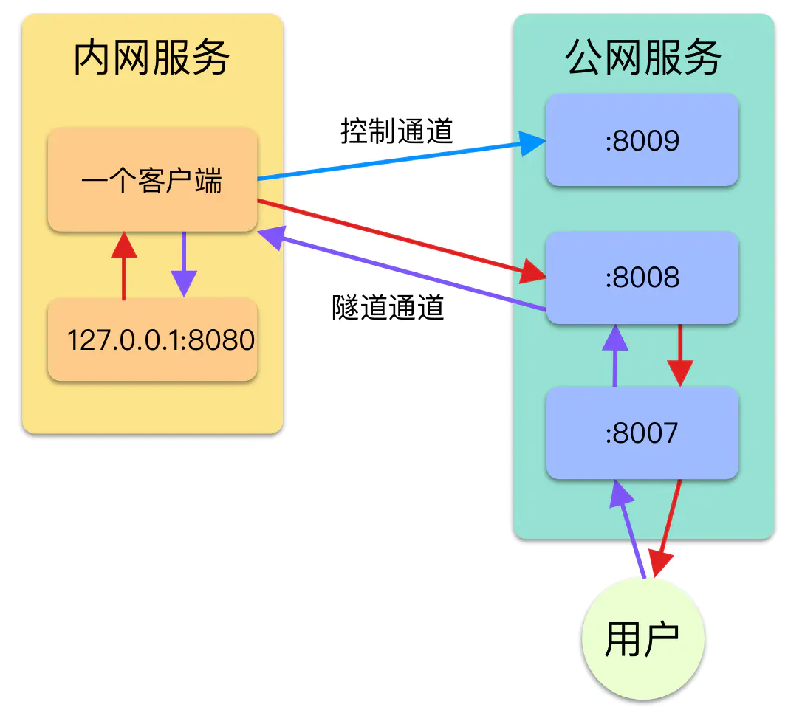

# 数据通道
---

## 背景要求
1. 支持TCP、HTTP、WS请求
2. SA作为Socket客户端接入，与实际客户端建立通道
3. 支持大数据量，多客户端接入

## 基本架构
1. SC服务端
> 1. 监听对外端口，把请求数据转发到通道
> 2. 监听控制端口，与SA建立控制通道
> 3. 监听通道端口，与SA建立数据通道
2. 控制通道：
> 1. 动态增减连接：动态通知SA与SC建立通道
> 2. 心跳检测：检测与SA连接状态
> 3. 控制映射端口：可控制数据转发的SA端口
3. SA客户端：
> 1. 连接控制通道，接收控制信号
> 1. 连接数据通道，建立数据通道，并根据控制信号将数据转发至HTTP监听端口或TCP监听端口



## 主要实现技术：io拷贝
``` golang
io.Copy(src, dest)
``` 
``` golang
func Join2Conn(local *net.TCPConn, remote *net.TCPConn) {
	go joinConn(local, remote)
	go joinConn(remote, local)
}

func joinConn(local *net.TCPConn, remote *net.TCPConn) {
	defer local.Close()
	defer remote.Close()
	_, err := io.Copy(local, remote)
	if err != nil {
		log.Println("copy failed ", err.Error())
		return
	}
}
``` 

## 流程图（动态通知SA连接）


## 后续讨论
1. 是否有必要使用SOCKS5对客户端进行认证：可能会增加客户端接入难度，高并发状态下会影响性能
2. 链接复用：当用于HTTPS普通请求时不需要链接复用。当用于一段时间内频繁操作时，链接复用更佳