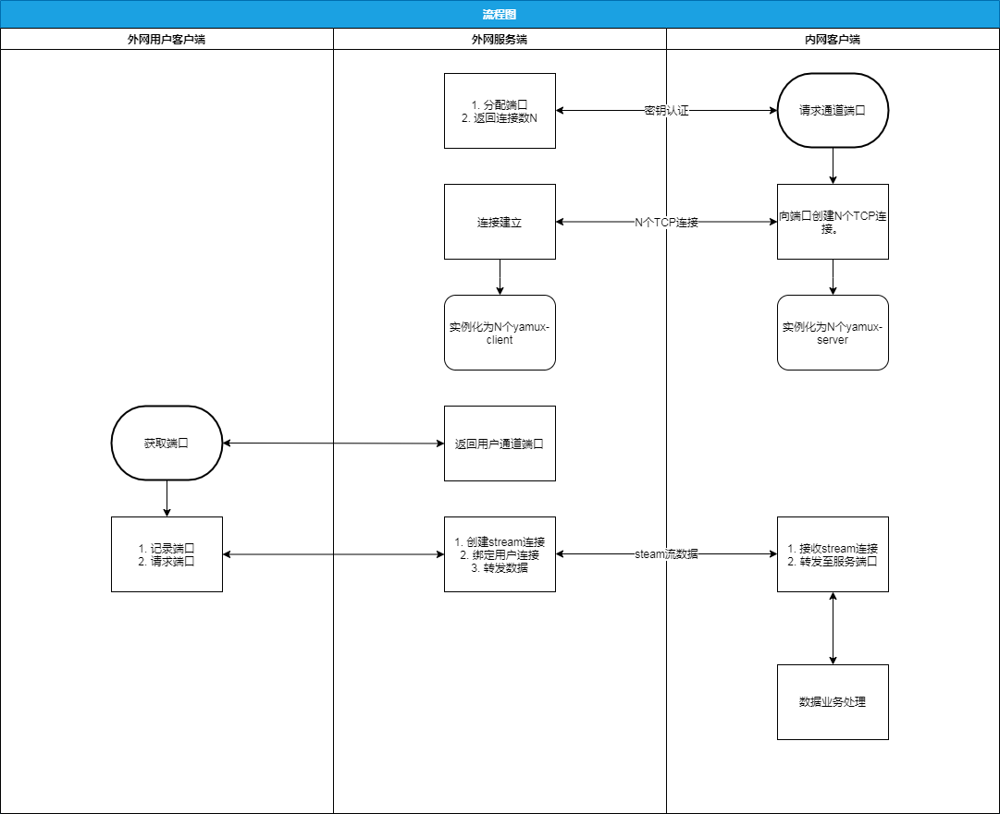
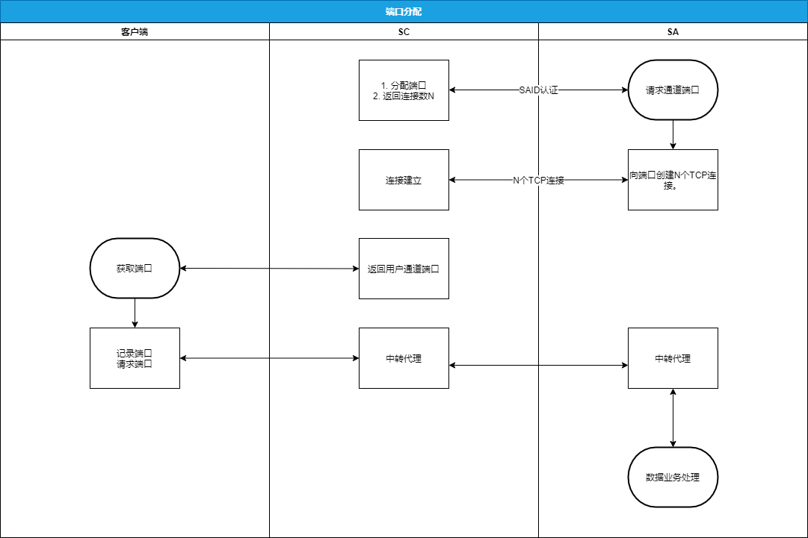
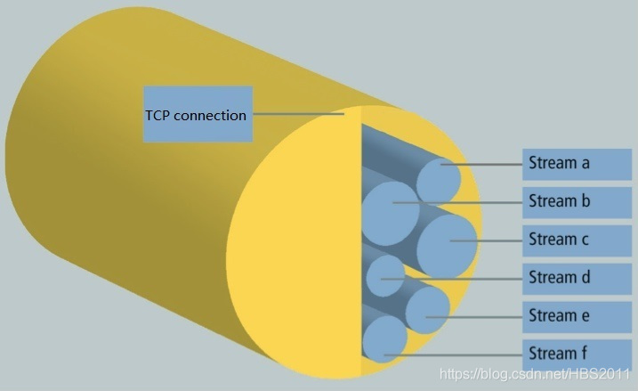
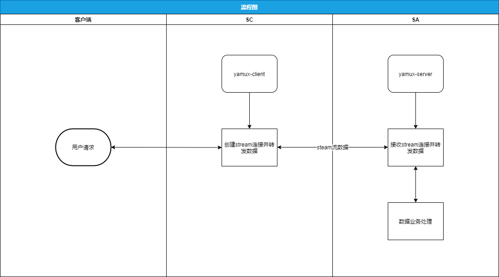
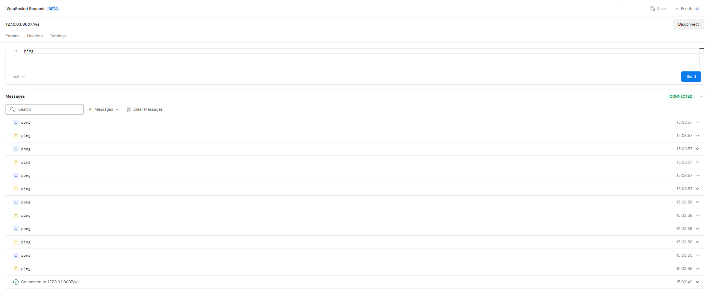

# 数据通道
---

## 背景要求
1. 支持TCP、HTTP、WS请求
2. SA作为Socket客户端接入，与实际客户端建立通道
3. 支持大数据量，多客户端接入

## 基本架构
1. SC服务端
> 1. 监听对外端口，把请求数据转发到通道
> 2. 监听通道端口，与SA建立数据通道
2. SA客户端：
> 1. 连接数据通道，建立数据通道
> 2. 转发数据至服务端口

## 流程图

## 主要机制
### 端口分配：
SA启动时请求通道接口，SC根据SA上报的SAID，分配出不重复的客户端通道端口与SA通道端口，并且返回连接数N 

### 多路复用/连接创建：
1. 背景：当客户端频繁使用短连接请求时，频繁创建与销毁TCP连接开销很大导致性能降低，所以提出对SA与SC之间TCP连接复用机制。
2. 选型 [yamux](https://github.com/hashicorp/yamux) 包来实现
   1. 原理：把一个TCP连接(session)虚化成多个异步数据流(stream) 
   
   2. yamux自带心跳检测
3. 机制：把N个TCP连接虚拟成N个session，接收到用户请求后再动态创建stream连接。 
   

## 测试结果：
1. websocket测试：

## TODO：
