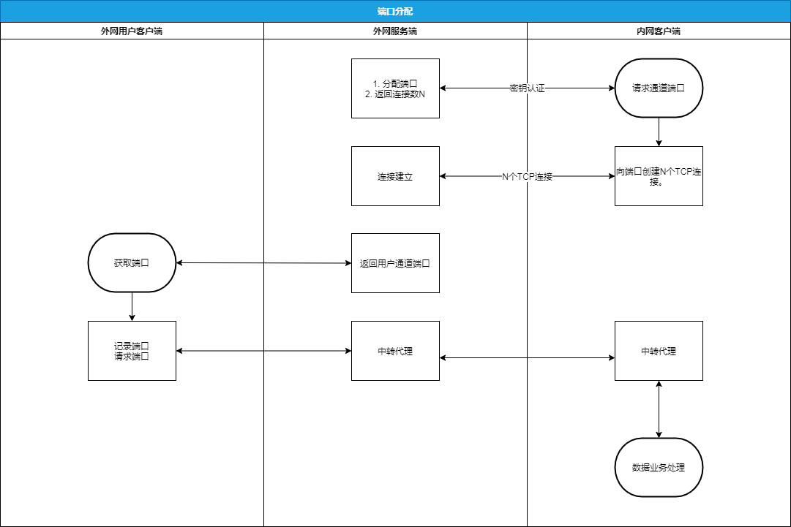

# 数据通道
---

## 背景要求
1. 支持TCP、HTTP、WS请求
2. SA作为Socket客户端接入，与实际客户端建立通道
3. 支持大数据量，多客户端接入

## 基本架构
1. SC服务端
> 1. 监听对外端口，把请求数据转发到通道
> 2. 监听控制端口，与SA建立控制通道
> 3. 监听通道端口，与SA建立数据通道
2. SA客户端：
> 1. 连接控制通道，接收控制信号
> 1. 连接数据通道，建立数据通道，并根据控制信号将数据转发至HTTP监听端口或TCP监听端口


## 主要机制
### 控制通道：
1. SA认证：每个SA连接控制通道后都需要发送SAID做控制通道认证，否则将会被断开连接，<br/>
   控制通道建立后将会创建一个Controller对象管理此SA通道。<br/>

   
2. 后续作用：
> 1. 动态增减连接：动态通知SA与SC建立通道
> 2. 心跳检测：检测与SA连接状态
> 3. 控制映射端口：可控制数据转发的SA端口
> 4. 通知SA被分配的端口

### 多路复用/连接创建：
1. 背景：当客户端频繁使用短连接请求时，频繁创建与销毁TCP连接开销很大导致性能降低，所以提出对SA与SC之间TCP连接复用机制，因此使用 [yamux](https://github.com/hashicorp/yamux) 包进行TCP连接多路复用<br/>
yamux原理：把一个TCP连接(session)虚化成多个数据流(steam)，并不互相阻塞<br/>


2. 机制：SA检测当通道连接小于等于3时，新建stream连接，否则创建TCP连接。<br/>


### 端口分配：
根据SA上报的SAID，分配出不重复的客户端通道端口与SA通道端口，并储存在数据库与map当中
>注意：若控制通道断开，端口会消除，重连会重新分配



## 主要实现技术：io拷贝
``` golang
io.Copy(src, dest)
``` 
``` golang
func Join2Conn(local *net.TCPConn, remote *net.TCPConn) {
	go joinConn(local, remote)
	go joinConn(remote, local)
}

func joinConn(local *net.TCPConn, remote *net.TCPConn) {
	defer local.Close()
	defer remote.Close()
	_, err := io.Copy(local, remote)
	if err != nil {
		log.Println("copy failed ", err.Error())
		return
	}
}
``` 

## 流程图


## 压力并发测试


1万次3并发GET请求，相应时间在2ms左右<br/>


HTTP服务响应时间：<br/>


pprof：<br/>


## 后续讨论
1. 是否有必要使用SOCKS5协议对客户端进行认证：
> 优点：SC接口现在没有任何认证防护，SC是否需要对数据解包与认证<br/>
> 缺点：可能会增加客户端接入难度，高并发状态下会影响性能